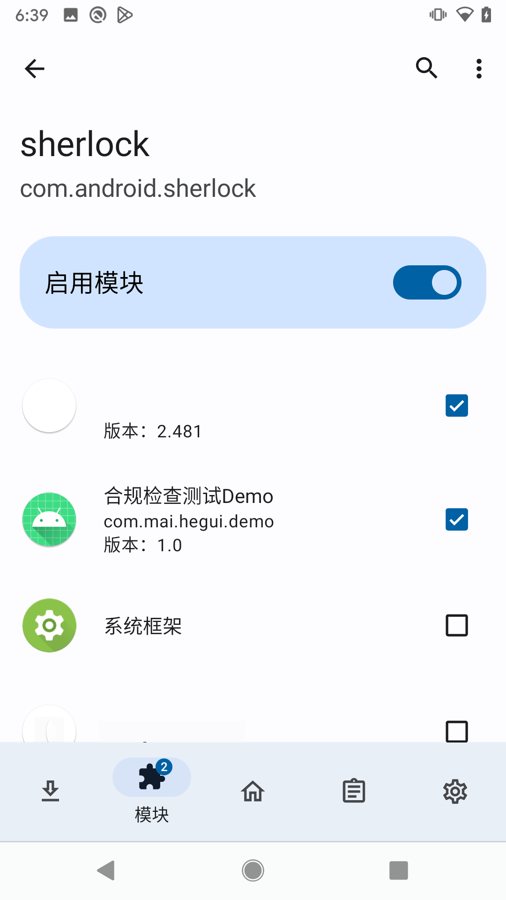
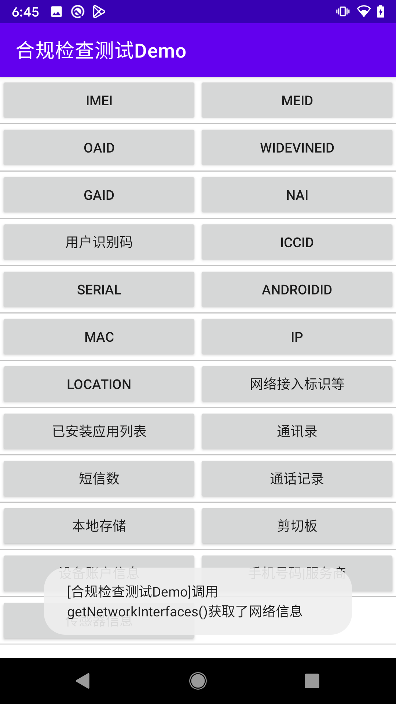

# 合规检查测试Demo

用于调试检查合规插件[Sherlock](https://github.com/MaYiFei1995/Sherlock)

---

## 说明

部分获取可能覆盖不够全面，OAID 在获取 GoogleDevice 时需要运行在子线程

## 使用

在 `Xposed` `VirtualXposed` `LSPosed` 等类似环境下激活`Sherlock`模块，并保证此应用在作用范围内

## 参考

- [《腾讯应用开放平台-隐私政策审核规范》](https://wikinew.open.qq.com/index.html#/iwiki/875339652)
- [《腾讯应用开放平台-隐私政策整改方法》](https://wikinew.open.qq.com/index.html#/iwiki/886144166)
- [《腾讯应用开放平台-个人信息规范名称和收集规则参考》](https://wikinew.open.qq.com/index.html#/iwiki/4006865844)